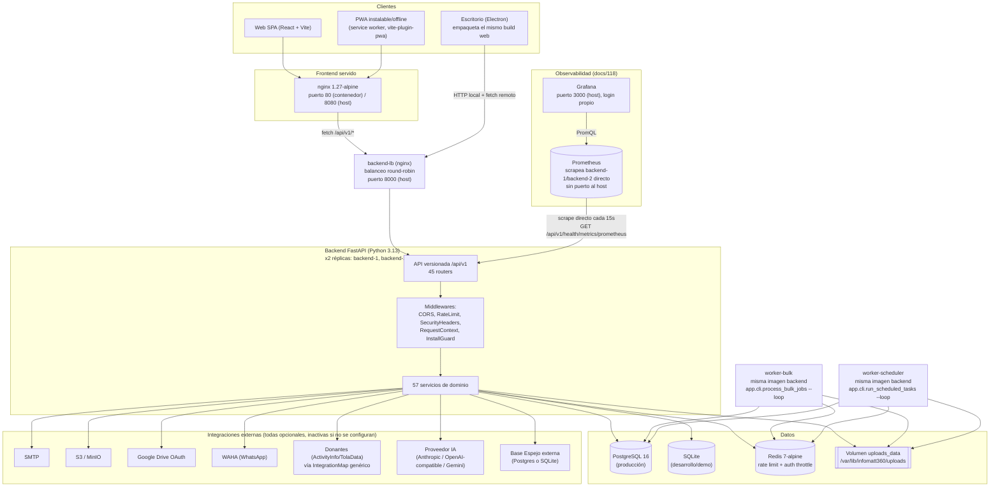

# Arquitectura Técnica de InfoMatt360

> Documento generado a partir de: `graphify-out/GRAPH_REPORT.md`, `graphify-out/graph.json` (grafo construido sobre el commit `26da141818ce32bbb4a109d43f8f1c4e62b0722a`), y lectura directa de la configuración real del repositorio (`docker-compose.production.example.yml`, `deploy/`, `.env.example`, `.env.production.example`, `backend/app/core/config.py`, `backend/app/main.py`, `README.md`, `docs/61` a `docs/65`, `scripts/`, `package.json`).
>
> **Alcance de la evidencia:** Graphify indexa código fuente (Python, TypeScript/TSX, JavaScript, Markdown de `docs/`) — **no indexa** archivos de infraestructura (Dockerfiles, YAML, `.env*`). Las secciones 8–11 (infraestructura, Docker, puertos, logging/backups, despliegue) están construidas leyendo esos archivos directamente, no desde el grafo; se indica en cada caso.
>
> Toda afirmación de este documento está respaldada por un archivo y, cuando aplica, una línea concreta del repositorio. Donde no existe evidencia en el repositorio, se marca explícitamente como **Pendiente de confirmar por infraestructura**.

---

## 1. Objetivo y alcance

InfoMatt360 es una plataforma de gestión territorial multi-tenant (white-label) para captura de formularios en campo, revisión/aprobación de registros, reportes, mapas, mensajería y varios módulos operativos (ERP interno, integraciones con donantes, auditoría con IA, sincronización a bases externas). Se distribuye en tres clientes que comparten el mismo backend: **aplicación web**, **aplicación de escritorio (Electron)** y **PWA instalable/offline**.

Este documento cubre el estado del código en la rama `main` al commit `26da141818ce32bbb4a109d43f8f1c4e62b0722a` (fuente: `graphify-out/GRAPH_REPORT.md`, campo `built_at_commit` en `graph.json`; confirmado con `git rev-parse HEAD`). No cubre infraestructura real desplegada (proveedor cloud, dominio, certificados) porque no existe evidencia de ello en el repositorio — ver marcas de **Pendiente de confirmar por infraestructura** en cada sección aplicable.

**Fuera de alcance de este documento:** SLAs de negocio, presupuesto, cronograma. Estos no son datos técnicos derivables del código.

---

## 2. Diagrama lógico de la solución



Fuente de los componentes y sus relaciones: `docker-compose.production.example.yml` (servicios `postgres`, `redis`, `backend-1`, `backend-2`, `backend-lb`, `worker-bulk`, `worker-scheduler`, `frontend`, `prometheus`, `grafana`), `deploy/backend.Dockerfile`, `deploy/frontend.Dockerfile`, `deploy/nginx.backend-lb.conf`, `deploy/prometheus.yml`, `deploy/grafana/provisioning/`, `backend/app/main.py` (middlewares y router), `backend/app/core/config.py` (integraciones opcionales).

---

## 3. Backend, frontend y componente de escritorio

### 3.1 Backend

- **Framework:** FastAPI sobre Uvicorn, Python 3.13 (`deploy/backend.Dockerfile:1`).
- **ORM/migraciones:** SQLAlchemy 2.x + Alembic (`backend/requirements.txt`, `backend/alembic/`, 63 migraciones versionadas a la fecha de este documento).
- **Estructura de capas** (confirmado por `backend/app/`): `models/` (38 archivos), `schemas/` (Pydantic, forma de entrada/salida), `services/` (57 archivos, lógica de negocio), `api/v1/` (45 routers HTTP), `core/` (configuración, seguridad, catálogo de permisos), `middleware/`, `cli/` (comandos de arranque/worker).
- **Punto de entrada:** `backend/app/main.py`, función fábrica `create_app()` — valida configuración de producción al arrancar (`validate_startup_settings()`), registra 4 middlewares en orden fijo (CORS → RateLimit → SecurityHeaders → RequestContext → InstallGuard) y monta `api_v1_router` bajo el prefijo `/api/v1`.
- **Grafo (community hub `runtime.py`, 42 nodos):** el módulo de mayor actividad de endpoints es el motor Runtime (captura de formularios), seguido por `ReviewService` (33 nodos) y `ApprovalFlowService` (38 nodos).

### 3.2 Frontend

- **Framework:** React + TypeScript + Vite (`frontend/package.json`).
- **Enrutamiento:** manual, sin librería de routing — `frontend/src/main.tsx` decide la vista por `switch` sobre el path (confirmado por comunidad de grafo `main.tsx`, 20 nodos: `AppRouter()`, `renderRoute()`, `PermissionGate()`).
- **Estado:** sin store global; cada módulo (`frontend/src/modules/*`) maneja su propio `useState`/`useEffect` y su propio archivo `xxxApi.ts` de acceso a la API.
- **PWA:** `vite-plugin-pwa` (`frontend/package.json`, devDependencies) genera `registerSW.js` y `manifest.webmanifest` para instalación y funcionamiento offline en navegador móvil.
- **Comunidades de grafo más grandes del frontend:** `RecordsApp.tsx` (40 nodos), `BuilderApp.tsx`, `ErpApp.tsx`, `GovernanceApp.tsx`.

### 3.3 Componente de escritorio (Electron)

- **Empaquetado:** `desktop/package.json` — `electron-builder`, `appId: org.infomatt360.desktop`, `extraResources` copia `frontend/dist` como `frontend-dist` dentro del paquete (evidencia directa de que **no es una app separada**, sino el mismo build web empaquetado).
- **Arranque** (`desktop/src/main.js`): resuelve la URL de inicio sirviendo el build del frontend por HTTP local (`startStaticServer`) en vez de `file://`, para que las rutas absolutas de la SPA (`/assets/...`, rutas profundas como `/runtime/xyz`) resuelvan igual que en despliegue web real.
- **Seguridad de la ventana:** `contextIsolation: true`, `nodeIntegration: false` (`desktop/src/main.js`), con `preload.js` como único puente controlado hacia el proceso de renderizado.
- **Cola offline:** `desktop/src/offlineQueue.js` + dependencia `sql.js` (SQLite compilado a WASM, `desktop/package.json`) — persiste registros capturados sin conexión y los sincroniza cuando vuelve la red.
- **Build multiplataforma:** scripts `build:win`, `build:linux`, `build:mac` vía `electron-builder` (`desktop/package.json`).

---

## 4. Servicios y módulos principales

Basado en las comunidades del grafo (`graphify-out/GRAPH_REPORT.md`, sección "Community Hubs" y bloque "Communities"), los módulos de dominio con mayor cohesión interna y tamaño son:

| Servicio / módulo | Nodos en su comunidad | Cohesión | Responsabilidad |
|---|---|---|---|
| `erp_service.py` | 68 | 0.06 | ERP headless: inventario, nómina, plantillas de configuración |
| `FormCompiler` | 48 | 0.06 | Compila un `BuilderTemplate` (diseño) a paquete Runtime v1 (JSON ejecutable) |
| `Participant` | 45 | 0.08 | Participante como eje central de datos (historial unificado, docs/98) |
| `ExternalDataService` | 45 | 0.09 | Caché de fuentes externas para pulldata dinámico en formularios |
| `ApprovalFlowService` | 38 | 0.08 | Flujos de aprobación configurables por proyecto |
| `MirrorService` | 39 | 0.09 | Base Espejo — replicación a Postgres/SQLite externo (docs/102) |
| `RecordsApp.tsx` | 40 | 0.09 | Pantalla + API client de registros (frontend) |
| `ReviewService` | 33 | 0.08 | Máquina de estados de revisión de registros (9 estados, docs/100) |
| `ExpressionEngine` | 35 | 0.05 | Motor de evaluación de reglas/condiciones de formularios |
| `GisService` | 25 | 0.09 | Mapas, capas y features geográficas |
| `SchedulerService` | 31 | 0.10 | Tareas programadas (`ScheduledTask`, respaldos recurrentes) |
| `Organization` | 25 | 0.12 | Multi-tenancy lógico, branding dinámico |
| `UserProjectAssignment` | 27 (comunidad 103) | 0.13 | Resolución de permisos (proyecto + organización) |

Nota: la **cohesión** reportada por Graphify mide qué tan interconectados están los nodos *dentro* de su propia comunidad (0 = disperso, 1 = totalmente interconectado). Valores bajos (`erp_service.py` 0.06, `FormCompiler` 0.06, `ExpressionEngine` 0.05) indican módulos grandes cuyos componentes internos se llaman entre sí con relativamente poca frecuencia — ver sección 12.

---

## 5. Base de datos y almacenamiento

- **Motor:** SQLAlchemy soporta el motor indicado por `DATABASE_URL`. En desarrollo/demo: SQLite (`backend/.env`, `DATABASE_URL=sqlite:///./infomatt360_dev.db`). En producción: PostgreSQL 16 obligatorio — `backend/app/main.py::validate_startup_settings()` **bloquea el arranque** si `DATABASE_URL` empieza con `sqlite` y `ENVIRONMENT=production`.
- **Pool de conexiones:** configurable vía `DB_POOL_SIZE` (10), `DB_MAX_OVERFLOW` (20), `DB_POOL_TIMEOUT_SECONDS` (30), `DB_POOL_RECYCLE_SECONDS` (1800) — `backend/app/core/config.py`.
- **Migraciones:** Alembic, 63 revisiones a la fecha (`backend/alembic/versions/`). `AUTO_CREATE_TABLES` debe ser `false` en producción (validado al arranque); en ese modo el esquema se gestiona **solo** vía `alembic upgrade head`, nunca `Base.metadata.create_all`.
- **Estructura de datos del motor de captura:** modelo EAV (Entity-Attribute-Value) — `runtime_records` (cabecera: proyecto, plantilla, estado, participante) + `runtime_record_values` (una fila por campo capturado: `record_id`, `field_name`, `field_value_json`). Confirmado por `RuntimeRecord`/`RuntimeRecordValue` como god nodes (77 y aristas propias, `backend/app/models/runtime_record.py`).
- **Almacenamiento de archivos/evidencias:**
  - Local por defecto: `UPLOAD_DIRECTORY` (`./uploads` en dev, `/var/lib/infomatt360/uploads` en producción, montado como volumen Docker `uploads_data`).
  - S3/MinIO opcional (`S3StorageService`, comunidad de grafo 93, cohesión 0.50 — muy cohesionada, módulo pequeño y autocontenido).
  - Google Drive opcional vía OAuth (`GoogleDriveStorageService`).
  - Selección de proveedor por `StorageProfile` (por proyecto), credenciales cifradas con Fernet antes de persistir (`encrypt_text`/`decrypt_text`, `backend/app/core/security.py`).
- **Base Espejo (replicación externa, docs/102):** `MirrorService` replica `runtime_records`/`runtime_record_values` hacia un Postgres o SQLite externo, con prefijo de tabla `im360_` para no colisionar con datos del cliente destino. Sincronización manual (`POST /mirror/plans/{id}/run`), modos `full_mirror` e `insert_only`.
- **Caché/estado efímero:** Redis, usado exclusivamente para *rate limiting* distribuido y *auth throttling* cuando `API_RATE_LIMIT_BACKEND=redis` / `AUTH_THROTTLE_BACKEND=redis` (por defecto en dev: en memoria / base de datos). No se usa Redis como caché de aplicación general — no hay evidencia de ello en el código.
- **Respaldos:** ver sección 10.

---

## 6. Integraciones externas

Todas las integraciones externas son **opcionales y quedan inactivas por defecto** (sin credenciales configuradas, el conector no se activa) — patrón confirmado en múltiples comentarios de `backend/app/core/config.py`:

| Integración | Servicio | Configuración (env) | Estado sin configurar |
|---|---|---|---|
| Correo (SMTP) | recuperación de contraseña, notificaciones | `SMTP_HOST`, `SMTP_PORT`, `SMTP_USERNAME`, `SMTP_PASSWORD`, `SMTP_FROM_EMAIL`, `SMTP_USE_TLS` | Token de recuperación solo se registra en logs (`docs/61`, advertencia de `health/ready`) |
| Almacenamiento S3/MinIO | `S3StorageService` | credenciales por `StorageProfile`, cifradas en BD | Inactivo, cae a almacenamiento local |
| Google Drive | `GoogleDriveStorageService` | `GOOGLE_OAUTH_CLIENT_ID`, `GOOGLE_OAUTH_CLIENT_SECRET`, `GOOGLE_OAUTH_REDIRECT_URI` | Inactivo |
| WhatsApp (WAHA) | notificaciones vía gateway WAHA | `WAHA_BASE_URL`, `WAHA_API_KEY`, `WAHA_SESSION` | Inactivo |
| Donantes (ActivityInfo/TolaData u otros) | `IntegrationService`, salida por evento (push) | `IntegrationSource`/`IntegrationMap` configurados por proyecto vía API | Sin fuente configurada, no se envía nada |
| Auditoría semántica con IA | `AiAuditConfig` | `AI_AUDIT_PROVIDER` (`anthropic` \| `openai_compatible` \| `gemini`), `AI_AUDIT_API_KEY`, `AI_AUDIT_BASE_URL`, `AI_AUDIT_MODEL` | Se registra como `skipped` |
| API de lectura externa | `external_api.py` | autenticación por API key propia (`ProjectApiKey`) | Requiere API key emitida explícitamente |
| Base Espejo | `MirrorService` | credenciales por `MirrorTarget`, cifradas | Sin destino configurado, no hay sincronización |
| Redis | rate limiting / throttling distribuido | `REDIS_URL`, `API_RATE_LIMIT_BACKEND`, `AUTH_THROTTLE_BACKEND` | Cae a memoria (rate limit) / base de datos (auth throttle) — **no apto para múltiples réplicas** |

**Pendiente de confirmar por infraestructura:** qué integraciones están realmente activadas en un entorno productivo específico (depende de las credenciales reales configuradas, no versionadas — ver `.gitignore`: `.env`, `.env.production` están excluidos del repositorio).

---

## 7. Autenticación, autorización y seguridad

### 7.1 Autenticación

- **JWT** de acceso (`ACCESS_TOKEN_EXPIRE_MINUTES=60`, `JWT_ALGORITHM=HS256`) + **refresh token** en cookie `httpOnly` (`REFRESH_COOKIE_NAME=infomatt360_refresh`, `REFRESH_COOKIE_SECURE`, `REFRESH_COOKIE_SAMESITE=strict`, `REFRESH_TOKEN_EXPIRE_DAYS=7`).
- **Sesión extendida para dispositivos de campo** ya enrolados: `access_token_expire_minutes_field_device=600` (10 h) — comentario explícito en `config.py`: "trabajan largas jornadas rurales sin conectividad para renovar el token".
- **MFA TOTP** disponible (`MfaService`, comunidad de grafo 107, cifrado del secreto con Fernet).
- **Autenticación alternativa para integraciones:** API keys por proyecto (`ProjectApiKey`), con perfiles de *rate limit* propios.
- **Instalador de primer arranque:** `InstallGuardMiddleware` bloquea el resto de la API hasta completar `POST /api/v1/install/bootstrap` cuando `installer_enforced=true` (desactivado por defecto para no romper despliegues/demo existentes).

### 7.2 Autorización

- **Catálogo central de permisos:** un único archivo, `backend/app/core/permissions.py`, evita que backend/frontend/seeders/documentación diverjan.
- **Alcance de permisos, dos niveles** (god node `require_project_permission()`, 51 llamadores según `graphify explain`):
  - `UserProjectAssignment` — rol asignado a un proyecto puntual.
  - `UserOrganizationAssignment` (docs/101) — rol asignado a nivel de Organización completa, se propaga automáticamente a todos sus proyectos (implementa el rol "Administrador nacional" sin un tipo de rol nuevo).
- **Patrón de verificación uniforme:** todo endpoint sensible llama a `require_project_permission`/`require_any_permission`/`require_permission_in_organization` antes de tocar el servicio (capa `app/api/permissions.py`).

### 7.3 Seguridad de transporte y cabeceras

- **CORS** explícito por `CORS_ALLOWED_ORIGINS`, sin comodín permitido en producción (`validate_startup_settings()`).
- **Cabeceras de seguridad** (`SecurityHeadersMiddleware`, activable por `SECURITY_HEADERS_ENABLED`): `Content-Security-Policy`, `Referrer-Policy: no-referrer`, `X-Frame-Options: DENY`, `Permissions-Policy` restrictiva — mismos valores replicados también en `deploy/nginx.frontend.conf` para el frontend estático.
- **Rate limiting** (`ApiRateLimitMiddleware`): `API_RATE_LIMIT_REQUESTS=120` por `API_RATE_LIMIT_WINDOW_SECONDS=60`, límites distintos para tráfico por API key (`10000`) y "alto volumen" (`1000000`); backend en memoria o Redis.
- **Auth throttling** (bloqueo de intentos de login), backend en base de datos o Redis (`AUTH_THROTTLE_BACKEND`).
- **Cifrado de secretos en reposo:** `encrypt_text`/`decrypt_text` (Fernet, clave derivada de `SECRET_KEY`) para credenciales de S3, Google Drive, WAHA, Base Espejo — nunca texto plano en base de datos.
- **Validación de arranque en producción** (`validate_startup_settings()`, `backend/app/main.py`): bloquea el arranque completo si `DEBUG=true`, `SECRET_KEY` es el valor por defecto o tiene menos de 32 caracteres, `AUTO_CREATE_TABLES=true`, `DATABASE_URL` es SQLite, CORS con comodín o vacío, `FRONTEND_URL` sin HTTPS, cookies de refresh no-seguras, rate limiting/logging/métricas/cabeceras de seguridad desactivados, o Redis requerido sin `REDIS_URL`. Es una lista de **fail-fast** real, no documentación aspiracional — está en el código de arranque.

---

## 8. Infraestructura y topología de despliegue

*(No proviene del grafo — evidencia de `docker-compose.production.example.yml` y `deploy/*`.)*

La receta de referencia (`docker-compose.production.example.yml`) define 10 servicios:

| Servicio | Imagen/build | Puerto expuesto (host:contenedor) | Depende de | Healthcheck |
|---|---|---|---|---|
| `postgres` | `postgres:16` | interno (no publicado al host) | — | `pg_isready` cada 10s |
| `redis` | `redis:7-alpine` (AOF activado) | interno | — | `redis-cli ping` cada 10s |
| `backend-1` | build `deploy/backend.Dockerfile` | interno (no publicado al host) | `postgres` (healthy), `redis` (healthy) | `GET /api/v1/health/ready` cada 30s |
| `backend-2` | build `deploy/backend.Dockerfile` | interno (no publicado al host) | `postgres` (healthy), `redis` (healthy) | `GET /api/v1/health/ready` cada 30s |
| `backend-lb` | `nginx:1.27-alpine` + `deploy/nginx.backend-lb.conf` | `8000:80` | `backend-1` (healthy), `backend-2` (healthy) | `wget --spider http://127.0.0.1/api/v1/health/ready` cada 30s |
| `worker-bulk` | misma imagen que `backend-1`/`backend-2` | — (sin puerto, proceso batch) | `postgres` (healthy), `redis` (healthy) | sin healthcheck definido |
| `worker-scheduler` | misma imagen que `backend-1`/`backend-2` | — (sin puerto, proceso batch) | `postgres` (healthy), `redis` (healthy) | sin healthcheck definido |
| `frontend` | build `deploy/frontend.Dockerfile` (nginx) | `8080:80` | `backend-lb` (healthy) | sin healthcheck definido |
| `prometheus` | `prom/prometheus:v3.0.1` | interno (no publicado al host) | `backend-1` (healthy), `backend-2` (healthy) | sin healthcheck definido |
| `grafana` | `grafana/grafana:11.4.0` | `3000:3000` | `prometheus` | sin healthcheck definido |

**Volúmenes persistentes:** `postgres_data`, `redis_data`, `uploads_data` (montado en `backend-1`, `backend-2`, `worker-bulk` y `worker-scheduler` como `/var/lib/infomatt360/uploads`), `prometheus_data`, `grafana_data`.

**Observabilidad (docs/118, cerrado 2026-07-23):** `prometheus` scrapea `backend-1:8000` y `backend-2:8000` directo cada 15s en `/api/v1/health/metrics/prometheus` (nunca a través de `backend-lb` — `metrics_service.py` guarda contadores en memoria por proceso, así que scrapear vía el balanceador daría una serie inconsistente entre scrapes). Requiere autenticación (mismo JWT que cualquier otro endpoint, `require_metrics_viewer`); como Prometheus no puede iniciar sesión interactivamente, `python -m app.cli.generate_metrics_token` crea un usuario de servicio no interactivo (rol asignado a nivel de Organización, mismo patrón "Administrador nacional" de docs/101, permiso `integrations.api_keys.manage` reutilizado por no existir uno dedicado de solo-métricas) y emite un JWT de 10 años; el token vive en `secrets/metrics_token` (fuera de git) montado en el contenedor, nunca en el compose ni en variables de entorno. `prometheus` no publica puerto al host (su UI no tiene autenticación propia); se consulta a través de `grafana` (puerto `3000`, sí requiere login, contraseña en `GF_SECURITY_ADMIN_PASSWORD`) con un datasource y un dashboard inicial ("InfoMatt360 - Visión general") provisionados automáticamente desde `deploy/grafana/provisioning/`.

**Balanceo de carga y réplicas (E-001, cerrado 2026-07-20, docs/117):** `backend-lb` (nginx, `deploy/nginx.backend-lb.conf`) reparte round-robin entre `backend-1` y `backend-2` (`upstream backend_upstream { server backend-1:8000; server backend-2:8000; }`), con `proxy_next_upstream error timeout http_502 http_503 http_504` para saltar a la otra réplica si una falla. Es el único servicio del grupo backend que publica el puerto `8000` al host — `backend-1`/`backend-2` ya no lo hacen. Tiene IP fija `172.28.0.10` en la subred `172.28.0.0/24` (declarada en el bloque `networks` al final del compose) para que `backend-1`/`backend-2` puedan distinguir su tráfico vía `API_RATE_LIMIT_TRUSTED_PROXY_IPS=172.28.0.10` (`.env.production.example`) y no traten a todos los clientes como si vinieran de la IP de `backend-lb` en el rate limiting/throttle de login.

**Topología de red:** todos los servicios comparten la red `default` de Docker Compose, con subred fija `172.28.0.0/24`; solo `backend-lb` (8000), `frontend` (8080) y `grafana` (3000) publican puertos al host. `postgres`, `redis`, `backend-1`, `backend-2` y `prometheus` **no** son accesibles fuera de la red interna de Compose en esta receta — `prometheus` deliberadamente, por no tener autenticación propia (ver observabilidad arriba).

**Reverse proxy / TLS / dominio:** **no está incluido en la receta**. `docs/61_DESPLIEGUE_PRODUCCION_REFERENCIA.md` es explícito: *"Estos archivos son una base de referencia. Antes de usarlos en producción real deben conectarse a dominio, TLS/HTTPS, backups, monitoreo y gestión de secretos del proveedor de infraestructura."* → **Pendiente de confirmar por infraestructura.** (`backend-lb` resuelve el balanceo entre réplicas, no TLS ni dominio — sigue siendo un salto distinto.)

**Proveedor cloud / VPS / on-premise:** decisión tomada 2026-07-20 — VPS/servidor propio con Docker Compose (no cloud gestionado), confirmado por el usuario. **Escalado horizontal, número de réplicas, balanceador de carga:** resuelto en esta receta (2 réplicas + `backend-lb`); llevar a más de 2 réplicas requiere solo duplicar el bloque `backend-N` y agregarlo al `upstream` de `deploy/nginx.backend-lb.conf`. **Script de prueba de carga:** construido (docs/119) — `loadtest/k6-infomatt360.js` (k6), probado de punta a punta con Podman a escala de decenas de VUs con 0% de error una vez ajustado el rate limiting por IP (ver abajo). **Evidencia de carga real a escala de 3.000 usuarios que justifique más de 2 réplicas o réplicas dinámicas (autoscaling):** sigue sin existir — la herramienta ya está lista, pero generarla requiere correrla contra un despliegue real en el VPS que decida el usuario; una VM de desarrollo con Podman no es representativa de la capacidad real. **Hallazgo real de esta verificación:** el límite de tasa por IP (`API_RATE_LIMIT_REQUESTS`, default 120/60s) se aplica a todo el tráfico proveniente de una sola IP de origen — un generador de carga corriendo desde una sola máquina hace que todos sus VUs compartan esa IP, así que el límite corta la prueba mucho antes de acercarse a 3.000 usuarios reales si no se sube temporalmente antes de correrla (documentado en `loadtest/README.md`); esto no es un defecto, es el mismo límite antiabuso funcionando como se diseñó.

---

## 9. Docker, puertos, variables de entorno y dependencias

### 9.1 Imágenes Docker

| Imagen | Base | Notas |
|---|---|---|
| `backend` | `python:3.13-slim` | Instala `backend/requirements.txt`, expone `8000`, arranca con `uvicorn app.main:app --host 0.0.0.0 --port 8000` (`deploy/backend.Dockerfile`); usada por `backend-1` y `backend-2` |
| `frontend` | build: `node:24-alpine` → sirve: `nginx:1.27-alpine` | Build multi-stage: `npm ci && npm run build`, luego copia `dist/` al nginx; expone `80` (`deploy/frontend.Dockerfile`) |
| `backend-lb` | `nginx:1.27-alpine` (sin build propio) | Config vía `deploy/nginx.backend-lb.conf` montado como volumen, sin Dockerfile — mismo criterio que `frontend` pero sin build multi-stage |
| `prometheus` | `prom/prometheus:v3.0.1` (oficial, sin build propio) | Config vía `deploy/prometheus.yml` montado como volumen |
| `grafana` | `grafana/grafana:11.4.0` (oficial, sin build propio) | Provisioning vía `deploy/grafana/provisioning/` montado como volumen |

`worker-bulk` y `worker-scheduler` reutilizan la imagen `backend` con un comando distinto cada uno (ver sección 8) — ninguno tiene Dockerfile propio.

### 9.2 Puertos (todos verificados en archivos de configuración)

| Puerto | Servicio | Contexto |
|---|---|---|
| `8000` | Backend (Uvicorn) | Dev local, sin balanceador (`README.md`) |
| `8000` | `backend-lb` (nginx, publicado al host) | `docker-compose.production.example.yml` — único punto de entrada al backend en producción; `backend-1`/`backend-2` ya no publican puerto |
| `5173` | Frontend (Vite dev server) | Solo desarrollo local (`README.md`, `CORS_ALLOWED_ORIGINS` por defecto) |
| `8080` | Frontend (nginx, publicado al host) | `docker-compose.production.example.yml` |
| `80` | Frontend (nginx, dentro del contenedor) | `deploy/frontend.Dockerfile` |
| `80` | `backend-lb` (nginx, dentro del contenedor) | `deploy/nginx.backend-lb.conf`, mapeado a `8000` en el host |
| `5432` | PostgreSQL | Interno a la red Compose |
| `6379` | Redis | Interno a la red Compose |
| `9090` | Prometheus | Interno a la red Compose — deliberadamente sin publicar al host, su UI no tiene autenticación propia |
| `3000` | Grafana (publicado al host) | `docker-compose.production.example.yml` — sí tiene login propio |

### 9.3 Variables de entorno

Fuente: `backend/app/core/config.py` (clase `Settings`, valores por defecto) contrastada con `.env.example` (desarrollo) y `.env.production.example` (producción).

| Variable | Default dev | Ejemplo producción | Obligatoria en prod |
|---|---|---|---|
| `ENVIRONMENT` | `development` | `production` | Sí — activa todas las validaciones de `validate_startup_settings()` |
| `DEBUG` | `true` | `false` | Sí |
| `AUTO_CREATE_TABLES` | `true` | `false` | Sí |
| `DATABASE_URL` | `sqlite:///./infomatt360_dev.db` | `postgresql+psycopg2://...` | Sí (no SQLite) |
| `DB_POOL_SIZE` / `DB_MAX_OVERFLOW` / `DB_POOL_TIMEOUT_SECONDS` / `DB_POOL_RECYCLE_SECONDS` | `10` / `20` / `30` / `1800` | igual | No (tiene default razonable) |
| `SECRET_KEY` | valor de desarrollo | generado con `scripts/generate-secret.cmd`, ≥32 caracteres | Sí |
| `ACCESS_TOKEN_EXPIRE_MINUTES` / `REFRESH_TOKEN_EXPIRE_DAYS` | `60` / `7` | igual | No |
| `REFRESH_COOKIE_SECURE` | `false` | `true` | Sí |
| `REFRESH_COOKIE_SAMESITE` | `strict` | `strict` | Sí (`strict` o `lax`) |
| `UPLOAD_DIRECTORY` | `./uploads` | `/var/lib/infomatt360/uploads` | Sí (debe existir y ser escribible) |
| `FRONTEND_URL` | `http://localhost:5173` | `https://...` | Sí (HTTPS obligatorio) |
| `CORS_ALLOWED_ORIGINS` | `http://localhost:5173` | dominio(s) HTTPS explícitos | Sí (sin `*`) |
| `SMTP_*` (host, port, username, password, from, tls) | vacío | credenciales reales | Recomendado (recuperación de contraseña) |
| `API_RATE_LIMIT_ENABLED` / `_REQUESTS` / `_WINDOW_SECONDS` | `true` / `120` / `60` | igual | Sí (`ENABLED=true`) |
| `API_RATE_LIMIT_TRUSTED_PROXY_IPS` | vacío | `172.28.0.10` (IP fija de `backend-lb`, ver sección 8) | Sí desde docs/117 — si no, `X-Forwarded-For` se ignora y el rate limiting/throttle ve a todos los clientes como si vinieran de `backend-lb` |
| `REDIS_URL` | vacío | `redis://redis:6379/0` | Condicional (si `*_BACKEND=redis`) |
| `API_RATE_LIMIT_BACKEND` / `AUTH_THROTTLE_BACKEND` | `memory` / `db` | `redis` / `redis` | Recomendado con múltiples réplicas |
| `REQUEST_LOGGING_ENABLED` / `METRICS_ENABLED` / `SECURITY_HEADERS_ENABLED` | `true` / `true` / `true` | igual | Sí |
| `BULK_WORKER_*` (backoff, max backoff, stale after, heartbeat) | `60`/`3600`/`1800`/`100` | igual | No |
| `GOOGLE_OAUTH_*`, `WAHA_*`, `AI_AUDIT_*` | vacío | credenciales reales si se usan | No (opcionales) |
| `CONTENT_SECURITY_POLICY`, `REFERRER_POLICY`, `PERMISSIONS_POLICY`, `X_FRAME_OPTIONS` | valores restrictivos por defecto | igual | Sí |

`GF_SECURITY_ADMIN_PASSWORD` (contraseña del usuario `admin` de Grafana, docs/118) no es una variable de `Settings` — la lee directo el contenedor `grafana`, no `backend/app/core/config.py`. El token de scraping de Prometheus tampoco es una variable de entorno: vive en el archivo `secrets/metrics_token` (fuera de git), generado con `python -m app.cli.generate_metrics_token`.

**Gestión de secretos real (vault, KMS, variables de CI/CD):** no hay evidencia en el repositorio de un gestor de secretos conectado — `docs/61` solo indica *"los secretos productivos deben vivir en el gestor de secretos del servidor, proveedor cloud o pipeline CI/CD"* como recomendación, sin una implementación concreta versionada → **Pendiente de confirmar por infraestructura.**

### 9.4 Dependencias

**Backend** (`backend/requirements.txt`, sin versiones fijadas excepto `bcrypt<4.1`):
`fastapi`, `uvicorn[standard]`, `pydantic`, `pydantic-settings`, `python-dotenv`, `pytest`, `httpx`, `sqlalchemy`, `psycopg2-binary`, `alembic`, `redis`, `passlib[bcrypt]`, `bcrypt<4.1`, `python-jose[cryptography]`, `python-multipart`, `email-validator`, `cryptography`, `qrcode[pil]`, `openpyxl`, `jinja2`, `xhtml2pdf`, `boto3`.

**Frontend** (`frontend/package.json`): `react`, `react-dom`, `vite`, `@vitejs/plugin-react`, `typescript`, `jsqr` (lectura de QR). Dev: `vitest`, `vite-plugin-pwa`, `fake-indexeddb`, `@types/react*`.

**Escritorio** (`desktop/package.json`): `electron`, `electron-builder` (dev), `sql.js` (runtime).

**Riesgo de dependencias sin versión fijada:** la mayoría de paquetes de `requirements.txt` y `package.json` no tienen versión fijada (`latest` explícito en frontend, sin versión en backend salvo `bcrypt<4.1`) — esto significa que builds en fechas distintas pueden traer versiones distintas sin control de reproducibilidad. No hay `requirements.lock`, `poetry.lock` ni `package-lock.json` fijando versión exacta para el build de producción del backend (sí existe `package-lock.json` para frontend/desktop, generado por npm).

---

## 10. Logging, monitoreo, respaldos y recuperación

*(No proviene del grafo — evidencia de `backend/app/middleware/request_context.py`, `backend/app/services/metrics_service.py`, `backend/app/api/v1/health.py`, `scripts/`, `docs/63`, `docs/65`.)*

### 10.1 Logging

- **`RequestContextMiddleware`** (`backend/app/middleware/request_context.py`): genera o propaga un `X-Request-ID` por solicitud, mide duración, y — si `REQUEST_LOGGING_ENABLED=true` — emite una línea de log estructurado en **JSON** (`logging.getLogger("infomatt360.request")`) con `event`, `request_id`, `method`, `path`, `status_code`, `duration_ms`, `client_ip`.
- **Destino de los logs:** salida estándar del proceso (`logging` de Python sin handler adicional configurado) — no hay integración con un agregador de logs (ELK, Loki, CloudWatch, etc.) en el repositorio → **Pendiente de confirmar por infraestructura** (típicamente se resolvería con el driver de logs del orquestador/Docker, no versionado aquí).

### 10.2 Monitoreo y métricas

- **`MetricsService`** (comunidad de grafo, 3 nodos, cohesión 0.15): contadores HTTP en memoria (sin persistencia entre reinicios).
- **Endpoints:**
  - `GET /api/v1/health/` — estado básico, sin autenticación.
  - `GET /api/v1/health/ready` — valida DB, Redis (si aplica), directorio de uploads; devuelve `503` si no está listo, con lista de advertencias de configuración.
  - `GET /api/v1/health/metrics` — contadores HTTP + jobs bulk, requiere permiso (`METRICS_VIEW_PERMISSIONS`).
  - `GET /api/v1/health/metrics/prometheus` — mismo contenido en formato texto compatible Prometheus, requiere permiso.
  - Panel web: `/admin/metrics` (frontend, `OperationalMetricsApp.tsx`).
- **Integración real con Prometheus/Grafana:** resuelta (docs/118, cerrado 2026-07-23) — `deploy/prometheus.yml` scrapea `backend-1`/`backend-2` directo (nunca a través de `backend-lb`, ver sección 8) y `deploy/grafana/provisioning/` provisiona un datasource y un dashboard inicial ("InfoMatt360 - Visión general") automáticamente. Verificado en vivo con Podman: ambos targets en estado `up`, el dashboard mostrando datos reales. OpenTelemetry (trazas distribuidas) sigue sin implementar — no hay evidencia de ello en el repositorio → **Pendiente de confirmar por infraestructura** si se necesita.
- **Monitor liviano incluido:** `scripts/monitor-health.ps1`/`.cmd` — sondea `/health` y `/api/v1/health/ready` de backend y frontend en intervalo configurable, termina con código `2` y línea `ALERT` tras N fallos consecutivos (pensado para integrarse a una tarea programada externa, no es un daemon de monitoreo permanente).

### 10.3 Respaldos

- **Mecanismo:** `scripts/backup-postgres.ps1`/`.cmd` — ejecuta `pg_dump --format=custom` contra `DATABASE_URL` (leído de `.env.production` o pasado explícito), guarda en `backups/` (excluida de Git).
- **Restauración:** `scripts/restore-postgres.ps1`/`.cmd` — requiere `pg_restore`, exige el flag explícito `-ConfirmRestore RESTORE` porque es una operación destructiva; solo aplica a Postgres (rechaza explícitamente destinos SQLite).
- **Política documentada** (`docs/63_BACKUP_RESTORE_POSTGRES.md`): backup antes de cada despliegue, antes de cada migración Alembic, diario como mínimo; restauración probada periódicamente en ambiente no productivo.
- **Automatización real del backup diario (cron/tarea programada del SO):** no versionada en el repositorio → **Pendiente de confirmar por infraestructura.**
- **Respaldo también disponible desde la web** (`BackupService`, `docs/78`): dispara backup on-demand vía API (`POST /backups/run`), soporta SQLite (copia de archivo) o Postgres (`pg_dump`), guarda historial en `BackupJob`. Es un mecanismo complementario al script de infraestructura, no un reemplazo.

### 10.4 Recuperación

Ver sección 11 (rollback) — la recuperación ante fallo de despliegue y la recuperación ante pérdida/corrupción de datos comparten el mismo runbook (`docs/64_ROLLBACK_OPERATIVO.md`).

---

## 11. Flujo de despliegue, actualización y rollback

*(No proviene del grafo — evidencia de `README.md`, `docs/61`, `docs/62`, `docs/64`, `scripts/`.)*

### 11.1 Despliegue / actualización (fuente: `docs/61_DESPLIEGUE_PRODUCCION_REFERENCIA.md`)

1. Crear `.env.production` desde `.env.production.example`.
2. Generar `SECRET_KEY` fuerte (`scripts/generate-secret.cmd`).
3. Configurar secretos reales (Postgres, SMTP, `FRONTEND_URL`, CORS, ruta de uploads).
4. Validar configuración: `scripts/doctor-production.cmd -EnvFile .env.production`.
5. Validar que los artefactos productivos de referencia estén completos: `scripts/check-production-package.cmd`.
6. **Tomar backup** (`scripts/backup-postgres.cmd`) antes de migrar.
7. Ejecutar migraciones: `alembic upgrade head` (dentro del entorno del backend).
8. Levantar servicios: `docker compose -f docker-compose.production.example.yml --env-file .env.production up -d --build`.
9. Verificar: `scripts/check-health.cmd`, luego revisar `/api/v1/health/ready`, `/admin/metrics`, `/admin/bulk-jobs`, logs por `X-Request-ID`.

Checklist formal de go-live: `docs/62_CHECKLIST_GO_LIVE.md` (no reproducido aquí en detalle — referenciado como fuente).

### 11.2 Rollback (fuente: `docs/64_ROLLBACK_OPERATIVO.md`)

**Principio:** un rollback seguro exige 3 evidencias previas al despliegue: paquete/imagen anterior identificado, SHA256 o commit anterior registrado, backup de PostgreSQL tomado antes del cambio. Sin esas tres cosas, la situación se trata como incidente, no como rollback planeado.

**Si el despliegue falla sin migración destructiva:**
1. Volver a la imagen/paquete anterior.
2. `docker compose ... up -d --build backend-1 backend-2 backend-lb frontend worker-bulk worker-scheduler`.
3. Validar con `check-health.cmd`.
4. Revisar logs (`docker compose ... logs backend-1` / `backend-2` / `backend-lb` / `worker-bulk` / `worker-scheduler`).

**Si falla después de migraciones de base de datos** (ruta más delicada):
1. Detener tráfico / modo mantenimiento.
2. Detener `worker-bulk` y `worker-scheduler` (evitar escrituras nuevas).
3. Restaurar el backup en una base **temporal** primero.
4. Validar integridad funcional ahí.
5. Solo con aprobación del responsable, restaurar en la base objetivo (`scripts/restore-postgres.cmd ... -ConfirmRestore RESTORE`).
6. Levantar servicios con la versión anterior, `check-health.cmd`, revisar `/admin/metrics` y `/admin/bulk-jobs`.

**Integraciones externas durante rollback:** pausar sincronizaciones, comunicar ventana de congelamiento, registrar el último `X-Request-ID` procesado, reanudar desde el último lote confirmado al volver.

**Criterios de rollback exitoso:** `/api/v1/health/ready` en `ready`, login administrador funcional, worker bulk sin nuevos jobs atascados, sin incremento sostenido de `5xx`, API key de prueba responde, módulos principales (reportes/mapas/registros) abren correctamente.

**Pipeline de CI/CD que automatice este flujo:** no existe en el repositorio (no hay `.github/workflows`, ni configuración equivalente de otro proveedor) → todo el flujo de despliegue/rollback descrito es **manual, ejecutado por un operador siguiendo el runbook** → **Pendiente de confirmar por infraestructura** si se requiere automatización.

---

## 12. Riesgos técnicos detectados por Graphify

Evidencia: `graphify-out/GRAPH_REPORT.md` (God Nodes, Communities, Surprising Connections, Knowledge Gaps) y `graphify explain` sobre nodos específicos.

1. **`User` es un punto de centralidad estructural extremo.** 286 aristas (el nodo más conectado de todo el grafo, por un margen amplio sobre el segundo lugar, `Base` con 81) y la mayor *betweenness centrality* del grafo (0.165) — es el puente entre casi todas las comunidades de dominio (`Organization`, `Project`, `RuntimeRecord`, `ReviewService`, `ApprovalFlowService`, `MirrorService`, etc., según la sección "Suggested Questions" del reporte). **Riesgo:** cualquier cambio al modelo `User` tiene una superficie de impacto que atraviesa prácticamente todo el sistema, difícil de acotar por módulo.

2. **`require_project_permission()` es un gate de facto sin enforcement estructural.** 51 llamadores directos (`graphify explain require_project_permission`), repartidos en `ai_audit`, `approval_flows`, `erp`, `mirror`, `public_forms`, `records`, `xlsform`, `acta`, `api_keys`, entre otros. Es el patrón de autorización correcto y centralizado, pero **nada en el código obliga a invocarlo** en un endpoint nuevo — es responsabilidad del autor del endpoint recordarlo.

3. **Baja cohesión en módulos grandes:** `erp_service.py` (68 nodos, cohesión 0.06), `FormCompiler` (48 nodos, cohesión 0.06), `ExpressionEngine` (35 nodos, cohesión 0.05) son las comunidades más grandes y menos cohesionadas del backend — indicio de módulos que agrupan responsabilidades poco relacionadas entre sí bajo un mismo archivo/paquete.

4. **73 de las 81 aristas de `UserProjectAssignment` están marcadas como INFERRED** (no extraídas literalmente del AST, sino inferidas por el modelo de análisis, confianza promedio 0.72 según el resumen del reporte) — el propio grafo señala esta zona como de confianza reducida. Coincide con que la resolución de permisos está repartida entre `get_project_permissions()`, `require_permission_in_organization()` y `get_user_organization_ids()` (`app/api/permissions.py`), tres funciones con propósito similar pero rutas de código distintas.

5. **Patrón `setup_client` duplicado ~15 veces** entre los community hubs — cada archivo de pruebas backend define su propia versión casi idéntica del fixture de sesión/autenticación en vez de compartir uno común. No es un riesgo de producción, pero sí de mantenimiento de la suite de pruebas (mismo patrón copiado decenas de veces en `backend/tests/`).

6. **0 ciclos de importación detectados** — dato positivo, no un riesgo: pese al tamaño (57 servicios, 45 routers), ningún módulo se importa en círculo.

7. **`Base` (SQLAlchemy declarative base) tiene 79 de sus 81 aristas marcadas INFERRED** — mismo patrón de baja confianza que `UserProjectAssignment`; es estructuralmente correcto (todo modelo hereda de `Base`) pero el grafo no puede verificar automáticamente cada relación con alta confianza.

8. **959 nodos aislados** (≤1 conexión) — mayoritariamente metadata de `package.json` (`name`, `version`, `private`, etc.), no código real. No es una señal de alarma, es ruido esperado de archivos de configuración indexados como texto.

9. **Riesgo no capturado por Graphify pero relevante para este documento:** el grafo no indexa Dockerfiles/YAML/`.env*`, por lo que **no puede** detectar automáticamente riesgos de infraestructura (por ejemplo, ausencia de TLS en la receta de referencia, ausencia de CI/CD, dependencias sin versión fijada) — esos riesgos se identificaron por lectura directa del repositorio (secciones 8–11) y se documentan aquí porque son reales, no porque el grafo los haya señalado.

---

## 13. Recomendaciones priorizadas

Ordenadas por relación costo/impacto, basadas en los hallazgos de la sección 12 y la lectura directa de infraestructura:

### Alta prioridad
1. **Fijar versiones exactas de dependencias de producción** (backend: `requirements.txt` sin pines; frontend: varias en `latest`). Sin esto, dos builds en fechas distintas del mismo commit pueden producir binarios distintos — riesgo directo para reproducibilidad de rollback (sección 11 exige "imagen/paquete anterior identificado").
2. **Definir TLS/reverse proxy real antes de cualquier despliegue productivo** — la receta de referencia expone `backend:8000` y `frontend:8080` sin cifrado; `docs/61` ya lo advierte explícitamente, pero no hay ninguna configuración de ejemplo de proxy TLS en el repositorio (ni Traefik, ni Caddy, ni ejemplo de Nginx con certificados).
3. **Consolidar la resolución de permisos.** La lógica de "¿tiene este usuario acceso a este proyecto/organización?" vive en al menos 3 funciones distintas (`get_project_permissions`, `require_permission_in_organization`, `get_user_organization_ids`) con 73 aristas de baja confianza detectadas por el grafo — dos bugs de permisos ya se originaron en este patrón en el historial reciente del proyecto (endpoints nuevos que olvidaron llamar al gate correcto). Un helper único que resuelva "permisos efectivos de un usuario sobre un proyecto" (proyecto directo ∪ organización) reduciría el riesgo de repetir el error.

### Media prioridad
4. **Automatizar el pipeline de despliegue/rollback.** Hoy es 100% manual siguiendo `docs/61`/`docs/64` — funcional pero dependiente de que el operador no se salte un paso (ej. olvidar el backup antes de migrar).
5. **Conectar logging a un agregador real.** Los logs estructurados en JSON con `X-Request-ID` ya existen (`RequestContextMiddleware`) — falta el destino (ELK/Loki/CloudWatch/similar) para que el triage descrito en `docs/65` sea buscable en vez de depender de acceso directo al contenedor.
6. **Revisar `erp_service.py`, `FormCompiler` y `ExpressionEngine`** por posible descomposición en submódulos más cohesionados — son los tres archivos más grandes y menos cohesionados del backend según el grafo; no es urgente pero facilita mantenimiento futuro.

### Baja prioridad
7. **Deduplicar el fixture `setup_client`** entre archivos de prueba backend (repetido ~15 veces) hacia un `conftest.py` compartido — mejora de mantenibilidad de la suite de pruebas, sin impacto en producción.
8. **Automatizar el backup diario de Postgres** (cron/tarea programada) — el script existe y funciona (`scripts/backup-postgres.ps1`), pero su ejecución periódica no está versionada en este repositorio.

---

## 14. Inventario de componentes

| Componente | Ruta | Tecnología | Propósito |
|---|---|---|---|
| API backend | `backend/app/` | FastAPI, Python 3.13 | API versionada `/api/v1`, 45 routers |
| Migraciones | `backend/alembic/` | Alembic | 63 revisiones de esquema versionadas |
| Worker de cargas masivas | `backend/app/cli/process_bulk_jobs.py` | Python CLI | Procesa `BulkImportJob` fuera del proceso web |
| Worker de tareas programadas | `backend/app/cli/run_scheduled_tasks.py` | Python CLI | Ejecuta `ScheduledTask` (hoy: respaldos recurrentes) |
| Seed de datos demo | `backend/app/cli/seed_demo.py` | Python CLI | Datos idempotentes para validar el MVP localmente |
| Frontend web | `frontend/src/` | React + TypeScript + Vite | SPA, 18 módulos de dominio |
| Service worker / PWA | generado por `vite-plugin-pwa` | Workbox | Instalación y modo offline |
| Aplicación de escritorio | `desktop/src/` | Electron + sql.js | Empaqueta el mismo frontend, cola offline nativa |
| Imagen Docker backend | `deploy/backend.Dockerfile` | `python:3.13-slim` | Contenedor de API y worker bulk |
| Imagen Docker frontend | `deploy/frontend.Dockerfile` | `node:24-alpine` + `nginx:1.27-alpine` | Contenedor de frontend estático |
| Configuración nginx | `deploy/nginx.frontend.conf` | nginx | Cabeceras de seguridad + SPA fallback |
| Receta de despliegue | `docker-compose.production.example.yml` | Docker Compose | Orquestación de referencia (5 servicios) |
| Scripts operativos | `scripts/*.ps1` / `*.cmd` | PowerShell | Init, demo, doctor, backup, restore, release, UAT, monitoreo |
| Documentación funcional/técnica | `docs/*.md` | Markdown | 104 documentos numerados, uno por feature/decisión |
| Grafo de código | `graphify-out/` | Graphify | `graph.json`, `GRAPH_REPORT.md`, `graph.html` |

---

## 15. Anexos con evidencia del grafo

### 15.1 Metadatos del grafo

- Commit indexado: `26da141818ce32bbb4a109d43f8f1c4e62b0722a` (`graph.json`, campo `built_at_commit`; `GRAPH_REPORT.md` línea 13).
- Tamaño: 4623 nodos, 9356 aristas, 383 comunidades (374 mostradas, 9 comunidades "delgadas" con <3 nodos omitidas).
- Corpus: 598 archivos, ~195.381 palabras.
- Extracción: 86% EXTRACTED (tomada literalmente del AST), 14% INFERRED (inferida por el modelo de análisis, confianza promedio 0.72), 0% AMBIGUOUS.
- Costo de tokens de esta construcción del grafo: 0 (extracción solo por AST, sin llamadas a LLM — comando `graphify update .`).
- Ciclos de importación: **0 detectados.**

### 15.2 Top 10 God Nodes (nodos más conectados)

| # | Nodo | Aristas |
|---|---|---|
| 1 | `User` | 286 |
| 2 | `Base` | 81 |
| 3 | `UserProjectAssignment` | 81 |
| 4 | `RuntimeRecord` | 77 |
| 5 | `BuilderTemplate` | 64 |
| 6 | `Project` | 62 |
| 7 | `utc_now()` | 59 |
| 8 | `Role` | 58 |
| 9 | `authorizationHeader()` | 53 |
| 10 | `require_project_permission()` | 51 |

### 15.3 Conexiones sorprendentes reportadas por Graphify

- `test_demo_seed_supports_end_to_end_api_smoke_flow()` → `seed()` (INFERRED) — `backend/tests/test_demo_smoke_flow.py` → `backend/app/cli/seed_demo.py`.
- `test_acta_render_escapes_html_injection_in_data()` → `ActaTemplate` (INFERRED) — `backend/tests/test_acta.py` → `backend/app/models/acta.py`.
- `test_runtime_record_flags_possible_duplicate_on_identical_resubmission()` → `BuilderTemplate` (INFERRED) — `backend/tests/test_runtime_records.py` → `backend/app/models/builder.py`.
- `test_runtime_records_search_paginates_and_filters()` → `BuilderTemplate` (INFERRED) — mismo par de archivos que arriba.
- `test_password_policy_rejects_bcrypt_truncation()` → `PasswordResetRequest` (INFERRED) — `backend/tests/test_password_security.py` → `backend/app/schemas/auth.py`.

### 15.4 Detalle de `require_project_permission()` (evidencia para sección 12, hallazgo 2)

```
Node: require_project_permission()
  Source:    backend/app/api/permissions.py L51
  Community: UserProjectAssignment
  Degree:    51
```
Llamadores directos identificados (muestra parcial de 51, vía `graphify explain require_project_permission`): `update_approval_flow_step()`, `_require_target_access()`, `create_config()`, `add_approval_flow_step()`, `update_approval_flow()`, `create_template_config()`, `create_job()`, `create_map()`, `create_public_link()`, `correct_runtime_record_field()`, `import_xlsform()`, `create_acta_template()`, `update_acta_template()`, `analyze_record()`, `create_api_key()`, `create_approval_flow()`, y 31 más (funciones repartidas en `ai_audit`, `approval_flows`, `erp`, `mirror`, `public_forms`, `records`, `xlsform`, `acta`, `api_keys`, entre otros routers).

### 15.5 Knowledge Gaps reportados por Graphify

- 959 nodos aislados (≤1 conexión), predominantemente claves de `package.json` (`name`, `version`, `private`, `description`, `main`, +954 más).
- 9 comunidades "delgadas" (<3 nodos) omitidas del reporte completo.

### 15.6 Comandos usados para esta evidencia

```text
graphify update .
graphify explain "require_project_permission"
```
(el comando `graphify query` en modo BFS genérico se evaluó pero se descartó como fuente para este documento por ser demasiado ruidoso para un análisis arquitectónico formal — ver conversación previa a este documento).

---

*Documento generado por análisis asistido, sin edición manual de los datos citados del grafo o de los archivos de configuración. Cualquier sección marcada "Pendiente de confirmar por infraestructura" requiere información que no existe en este repositorio y debe completarse con el equipo de infraestructura/operaciones responsable del entorno real.*
